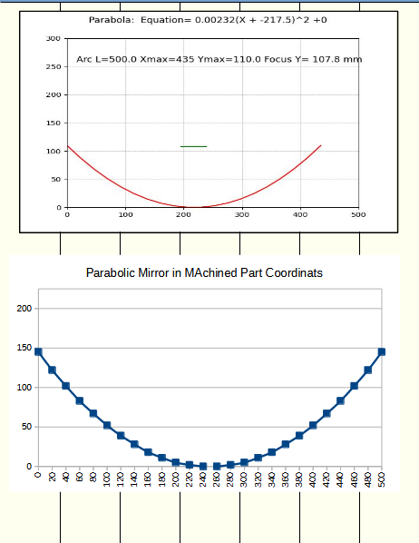

# MathBox 

## 1. Parabolic Mirror

INPUTS:

 Height of Mirror: Mechnical geometry 
 Width of mirror: Mechnical geometry 
 
OUTPUTS:
 
Arch Length:  Used to purchase plastic mirror. Stangard sizes are 500 x 500 or 500 x 1000 mm
Focus Height:  Itterated with goal of coinciding with height of mirror. 
 

